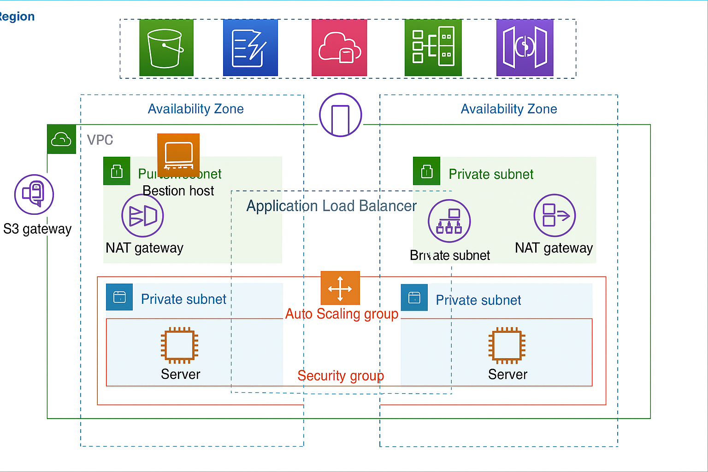

# AWS VPC High Availability Architecture (Manual Setup)

This project demonstrates how to set up a **high availability VPC architecture** on AWS manually (via AWS Console or CLI). The infrastructure includes private and public subnets, NAT gateways, bastion host, and an Application Load Balancer, all spread across **two Availability Zones** for fault tolerance.

---
## 🧱 Conceptual Architecture (Block Diagram)

---

## 🖼️ Architecture Diagram

---

## 📦 Components Overview

- 🏗️ **VPC**: Custom VPC that encapsulates the entire network structure  
- 🌐 **Public Subnets**: Host ALB, NAT Gateways, and Bastion Host  
- 🔒 **Private Subnets**: Host backend EC2 instances within Auto Scaling Groups  
- 🎯 **Application Load Balancer (ALB)**: Distributes traffic to backend EC2 instances  
- 🚪 **NAT Gateway**: Enables private EC2 instances to access the internet (outbound only)  
- 🛡️ **Bastion Host**: Deployed in a public subnet for SSH access to private EC2s (restricted)  
- ⚙️ **Auto Scaling Group**: Automatically manages EC2 instance count based on demand  
- 💻 **EC2 Instances**: Backend compute resources launched in private subnets  
- 🧭 **Route Tables**: Separate routing for public and private subnets  
- 🔐 **Security Groups**: Firewall rules at instance level to control traffic  
- 🧱 **Network ACLs**: Subnet-level firewall rules to add an extra layer of security  

---

## 🌐 Availability Zones Setup

The infrastructure is distributed across **AZ1 and AZ2**:
- Each AZ contains:
  - 1 Public Subnet (ALB + NAT Gateway)
  - 1 Private Subnet (EC2 + Auto Scaling Group)
- Only AZ1 contains the **Bastion Host**

---

## 🚀 Setup Instructions (Manual Steps)

### 1. Create VPC
- CIDR Block: e.g., `10.0.0.0/16`
- Enable DNS hostnames and DNS resolution

### 2. Create Subnets
- **Public Subnets** (AZ1 & AZ2): e.g., `10.0.1.0/24`, `10.0.2.0/24`
- **Private Subnets** (AZ1 & AZ2): e.g., `10.0.3.0/24`, `10.0.4.0/24`

### 3. Create and Attach Internet Gateway
- Attach to the VPC
- Update public subnet route tables to point to IGW

### 4. Create Route Tables
- **Public Route Table**: Route `0.0.0.0/0` → IGW
- **Private Route Table**: Route `0.0.0.0/0` → NAT Gateway

### 5. Launch NAT Gateways (one per AZ)
- Allocate Elastic IPs
- Deploy in each public subnet

### 6. Launch Bastion Host
- Deploy in Public Subnet (AZ1)
- Use limited Security Group (allow SSH only from trusted IPs)

### 7. Launch EC2 Instances in Private Subnets
- Associate IAM role (for CloudWatch, SSM if needed)
- No public IP
- Part of Auto Scaling Group

### 8. Configure Auto Scaling Group
- Launch Template → Private Subnet
- Attach to ALB Target Group

### 9. Create Application Load Balancer
- Deploy in public subnets (AZ1 & AZ2)
- Forward to target group of private EC2s
- Use listener on port 80/443

### 10. Security Group Configuration
- **ALB**: Allow HTTP/HTTPS from internet
- **Bastion Host**: Allow SSH from trusted IPs
- **EC2 Instances**:
  - Allow SSH from Bastion Host only
  - Allow app traffic from ALB SG only

---

## 🔐 Security Measures

<li>Use <strong>Security Groups</strong> to tightly control access (e.g., Bastion → Private EC2 only)</li>
<li>Use <strong>Network ACLs</strong> for subnet-level protection</li>
<li>Never assign <strong>public IPs</strong> to private subnet EC2s</li>
<li>Store <strong>SSH keys</strong> securely (or use EC2 Session Manager)</li>
<li>Add <strong>SSH Key</strong> only to Bastion Host</li>
<li>Limit SSH access to specific IP (use your static IP)</li>
<li>Use <strong>IAM Roles</strong> for EC2 rather than hardcoding credentials</li>

---

> [vipulvrx on GitHub](https://github.com/vipulvrx)
